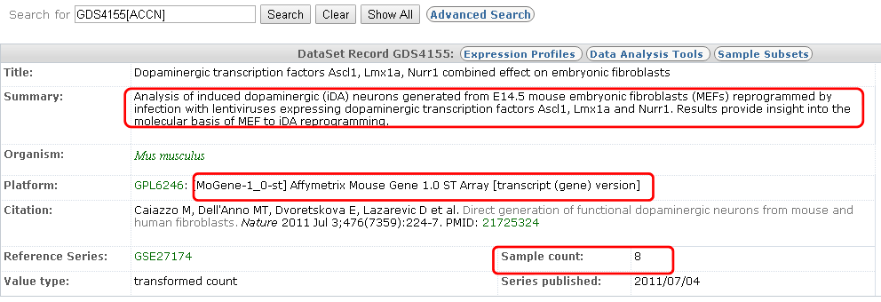
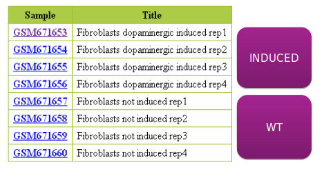
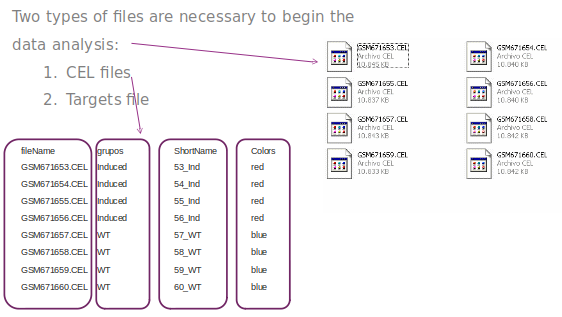

```{r class.source = 'fold-hide', setup, include=FALSE}
library(knitr)
library(rmdformats)

## Global options
options(max.print="75")
opts_chunk$set(echo=FALSE,
	             cache=FALSE,
               prompt=FALSE,
               tidy=TRUE,
               comment=NA,
               message=FALSE,
               warning=FALSE)
opts_knit$set(width=75)
```

# Introducción

Estudio del efecto de la inducción de neuronas dopaminérgicas en fibroblastos de ratones. Basado en un estudio cuyos datos se han repositado GEO con el identificador GDS4155.



```{r directorios}
workingDir <-getwd()
dataDir <- file.path(workingDir, "dades")
resultsDir <- file.path(workingDir, "results")
```

```{r paquetes}
if (!require(BiocManager)) install.packages("BiocManager")

installifnot <- function (pkg){
  if (!require(pkg, character.only=T)){
    BiocManager::install(pkg)
  }
}
installifnot("pd.mogene.1.0.st.v1")
installifnot("mogene10sttranscriptcluster.db")
installifnot("oligo")
installifnot("limma")
installifnot("Biobase")
installifnot("arrayQualityMetrics")
installifnot("genefilter")
installifnot("annotate")
installifnot("xtable")
installifnot("gplots")
installifnot("GOstats")
installifnot("gplots")
```

# Lectura de los datos

Las muestras se agrupan en dos dos grupos:



Esta información se almacena en el archivo "targets.csv"



```{r leeTargets}
library(Biobase)
#TARGETS
targetsDF <-read.csv(file=file.path(dataDir,"targets.csv"), header = TRUE, sep=";") 
#DEFINE SOME VARIABLES FOR PLOTS
sampleNames <- as.character(targetsDF$ShortName)
sampleColor <- as.character(targetsDF$Colors)
# Creamos un objeto AnnotatedDataFrame
targets <- AnnotatedDataFrame(targetsDF)
```

Al leer los archivos .CEL aportamos la información que contiene el objeto targets

```{r leeCELFiles}
CELfiles <- targetsDF$fileName
rawData <- read.celfiles(file.path(dataDir,CELfiles), phenoData=targets)
rawData
```

# Control de calidad

## Con funciones "ad-hoc"

```{r graficosCalidad}
#BOXPLOT
boxplot(rawData, which="all",las=2, main="Intensity distribution of RAW data", 
        cex.axis=0.6, col=sampleColor, names=sampleNames)
```

```{r graficosCalidad2}
#HIERARQUICAL CLUSTERING
clust.euclid.average <- hclust(dist(t(exprs(rawData))),method="average")
plot(clust.euclid.average, labels=sampleNames, main="Hierarchical clustering of RawData", 
     cex=0.7,  hang=-1)
```

```{r graficosCalidad3}
#PRINCIPAL COMPONENT ANALYSIS
plotPCA <- function ( X, labels=NULL, colors=NULL, dataDesc="", scale=FALSE, formapunts=NULL, myCex=0.8,...)
{
  pcX<-prcomp(t(X), scale=scale) # o prcomp(t(X))
  loads<- round(pcX$sdev^2/sum(pcX$sdev^2)*100,1)
  xlab<-c(paste("PC1",loads[1],"%"))
  ylab<-c(paste("PC2",loads[2],"%"))
  if (is.null(colors)) colors=1
  plot(pcX$x[,1:2],xlab=xlab,ylab=ylab, col=colors, pch=formapunts, 
       xlim=c(min(pcX$x[,1])-100000, max(pcX$x[,1])+100000),ylim=c(min(pcX$x[,2])-100000, max(pcX$x[,2])+100000))
  text(pcX$x[,1],pcX$x[,2], labels, pos=3, cex=myCex)
  title(paste("Plot of first 2 PCs for expressions in", dataDesc, sep=" "), cex=0.8)
}

plotPCA(exprs(rawData), labels=sampleNames, dataDesc="raw data", colors=sampleColor,
        formapunts=c(rep(16,4),rep(17,4)), myCex=0.6)
```

```{r graficosCalidadAPDF}
#SAVE TO A FILE
pdf(file.path(resultsDir, "QCPlots_Raw.pdf"))
boxplot(rawData, which="all",las=2, main="Intensity distribution of RAW data", 
        cex.axis=0.6, col=sampleColor, names=sampleNames)
plot(clust.euclid.average, labels=sampleNames, main="Hierarchical clustering of samples of RawData", 
     cex=0.7,  hang=-1)
plotPCA(exprs(rawData), labels=sampleNames, dataDesc="raw data", colors=sampleColor,
        formapunts=c(rep(16,4),rep(17,4)), myCex=0.6)
dev.off()

```

## Control de calidad con el paquete `arrayQualityMetrics`

El control de calidad con arrayQualityMetrics consume cierto tiempo por lo que podemos optar por ejecutarlo, o no hacerlo, usando una variable de tipo lógico.

```{r arrayQM}
# Avoid re-running it each time  the script is executed.
rerun <- FALSE
if(rerun){
  arrayQualityMetrics(rawData,  reporttitle="QC_RawData", force=TRUE)
}
```

# Normalización

Utilzamos el método RMA

```{r normalizacion}
eset<-rma(rawData)
write.exprs(eset, file.path(resultsDir, "NormData.txt"))
eset
```

# Filtrado

```{r filtrado}
library(genefilter)
annotation(eset) <- "mogene10sttranscriptcluster.db"
eset_filtered <- nsFilter(eset, var.func=IQR,
         var.cutoff=0.75, var.filter=TRUE,
         filterByQuantile=TRUE)
#NUMBER OF GENES REMOVED
print(eset_filtered)

#NUMBER OF GENES IN
print(eset_filtered$eset)
```

La matriz de datos filtrados se extrae del objeto `filtered$eset$ y se utilizará en los pasos siguientes.

```{r Datosfiltrados}
filteredEset <- eset_filtered$eset
filteredData <- exprs(filteredEset)
colnames(filteredData) <- pData(eset_filtered$eset)$ShortName
```

# Selección de genes

Construimos un modelo lineal, es decir una matriz de diseño y una de contrastes, para el análisis.

Primero la matriz de diseño

```{r linearModel}
library(limma)
treat <- pData(filteredEset)$grupos
lev <- factor(treat, levels = unique(treat))
design <-model.matrix(~0+lev)
colnames(design) <- levels(lev)
rownames(design) <- sampleNames
print(design)
```

A continuación la matriz de contraste

```{r linearModel2}
#COMPARISON
cont.matrix1 <- makeContrasts( 
        Induced.vs.WT = Induced-WT,
        levels = design)
comparisonName <- "Efecto de la Inducción"
print(cont.matrix1)
```

Estimamos el modelo

```{r estimaModelo}
#MODEL FIT
fit1 <- lmFit(filteredData, design)
fit.main1 <- contrasts.fit(fit1, cont.matrix1)
fit.main1 <- eBayes(fit.main1)
```

El resultado del análisis se encuentra en el objeto `lmfit` y puede extraerse con la instrucción "topTable".

Recordemos que la instrucción `topTable` puede aplicar un filtro automàtico, basado en dos criterios distintos, "log fold change" y "p.value". En este caso retenemos únicamente los genes con un "log-fold-change" mayor de 3 y un p-valor ajustado inferior a 0.05

```{r results1}
topTab <-  topTable (fit.main1, number=nrow(fit.main1), coef="Induced.vs.WT", adjust="fdr",lfc=3, p.value=0.05)
dim(topTab)
head(topTab)
```

## Anotación de los resultados

Obtenemos los identificadores ENTREZ y GENE SYMBOL correspondientes a los probesets (identificados con los id de la compañía que produjo el microarray) que aparecen en la tabla de resultados.


```{r}
library(mogene10sttranscriptcluster.db)
keytypes(mogene10sttranscriptcluster.db)
anotaciones<- AnnotationDbi::select (mogene10sttranscriptcluster.db, keys=rownames(filteredData), columns=c("ENTREZID", "SYMBOL"))
```

Añadimos las columnas de anotaciones a la "topTable". 

Aunque esto se puede hacer de muchas formas utilizamos la metodología de concatenar las instrucciones usando "pipes" (%>%) y funciones del paquete `dplyr` que simplifican la lectura.

```{r}
library(dplyr)
topTabAnotada <- topTab %>%  
  mutate(PROBEID=rownames(topTab)) %>%
  left_join(anotaciones) %>% 
  arrange(P.Value) %>%
  select(7,8,9, 1:6)

head(topTabAnotada)
```

El resultado se puede escribir a un archivo de texto o a un archivo html

```{r}
write.csv2(topTabAnotada, file= file.path(resultsDir,"Genes seleccionados.csv"))
print(xtable(topTab,align="lllllll"),type="html",html.table.attributes="",
      file=file.path(resultsDir,"Genes seleccionados.html"))
```

## Visualización de resultados (1): Volcano Plot

```{r volcanoPlot}
genenames <- AnnotationDbi::select(mogene10sttranscriptcluster.db, 
                    rownames(fit.main1), c("SYMBOL"))
volcanoplot(fit.main1, highlight=10, names=genenames, 
            main = paste("Differentially expressed genes", colnames(cont.matrix1), sep="\n"))
abline(v = c(-3, 3))


pdf(file.path(resultsDir,"Volcanos.pdf"))
volcanoplot(fit.main1, highlight = 10, names = genenames, 
            main = paste("Differentially expressed genes", colnames(cont.matrix1), sep = "\n"))
abline(v = c(-3, 3))
dev.off()
```

## Visualización de resultados (2): Heatmaps

```{r heatmap}
selectedRows <- rownames(filteredData) %in% rownames(topTab)
selectedData <- filteredData[selectedRows,]

#HEATMAP PLOT
my_palette <- colorRampPalette(c("blue", "red"))(n = 299)
library(gplots)
heatmap.2(selectedData,
          Rowv=TRUE,
          Colv=TRUE,
          main="HeatMap Induced.vs.WT FC>=3",
          scale="row",
          col=my_palette,
          sepcolor="white",
          sepwidth=c(0.05,0.05),
          cexRow=0.5,
          cexCol=0.9,
          key=TRUE,
          keysize=1.5,
          density.info="histogram",
          ColSideColors=c(rep("red",4),rep("blue",4)),
          tracecol=NULL,
          srtCol=30)
```

# Análisis de significación biológica

A título ilustrativo realizaremos un análisis de enriquecimiento ("Over-Representation Analysis") a partir de la lista de genes seleccionados como diferencialmente expresados.

Para el análisis necesitamos dos colecciones de genes

- La lista seleccionada
- El _universo de genes_ es decir todos los genes que se han incluído en el análisis (hay quien pone todos los del chip o todos los del genoma).

La mayoría de programas necesitan que los identificadores de los genes sean en formato "ENTREZ" por lo que prepararemos ambas listas a la vez (aunque ya teníamos la de los genes seleccionados).

```{r}
library(mogene10sttranscriptcluster.db)
probesUniverse <- rownames(filteredData)
entrezUniverse<- AnnotationDbi::select(mogene10sttranscriptcluster.db, probesUniverse, "ENTREZID")$ENTREZID

topProbes <-   rownames(selectedData)
entrezTop<- AnnotationDbi::select(mogene10sttranscriptcluster.db, topProbes, "ENTREZID")$ENTREZID

# Eliminamos posibles duplicados

topGenes <- entrezTop[!duplicated(entrezTop)]
entrezUniverse <- entrezUniverse[!duplicated(entrezUniverse)]
```

Se pueden utilizar muchos paquetes para realizar un análisis de enriquecimiento genético. Cada uno de ellos realiza un análisis ligeramente diferente, pero las ideas subyacentes son las mismas.

En este ejemplo usamos "GOstats", que fue uno de los primeros paquetes disponibles en Bioconductor para realizar análisis de enriquecimiento.

La idea para usarlo es bastante simple: necesitamos crear un tipo especial de objeto llamado "Hiperparámetro" que puede ser de clase:

- `GOHyperGParams` para hacer un análisis basado en la Gene Ontology,
- `KEGGHyperGParams` para hacer un análisis basado en la base de datos REACTOMA,
- `PFAMHyperGParams` para basar el análisis en la base de daos PFAM.

```{r createHyperparameter}
library(GOstats)

# This parameter has an "ontology" argument. It may be "BP", "MF" or "CC"
# Other arguments are taken by default. Check the help for more information.

GOparams = new("GOHyperGParams",
    geneIds=topGenes, universeGeneIds=entrezUniverse,
    annotation="mogene10sttranscriptcluster.db", ontology="BP",
    pvalueCutoff=0.01)
```

```{r runORAnalysis}
GOhyper = hyperGTest(GOparams)
```

```{r summarizeORAesults}
head(summary(GOhyper))
dim(summary(GOhyper))
```


```{r ORAreport}
# Creamos un informe html con los resultados
GOfilename =file.path(resultsDir, "GOResults.html")
htmlReport(GOhyper, file = GOfilename, summary.args=list("htmlLinks"=TRUE))
```

